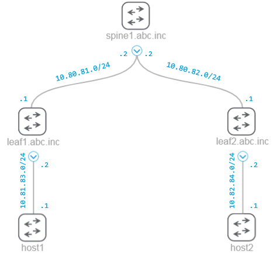

# dnac-ip-resolve
A module to perform IP to hostname resolution of network device.\
The resolution is based on queries against Cisco DNA Center platform Northbound API (Intent).

For each IP address in the input a new request "Get Interface by IP" is send to Cisco DNAC:\
`https://{dnac}/dna/intent/api/v1/interface/ip-address/{ipAddress}`

(we are checking if device with specific IP address, assigned to interface, exists in the database)

After successful response, new request is generated: "Get Device by ID" with supplied Device ID from previous response:\
`https://{dnac}/dna/intent/api/v1/network-device/{id}`

The response should contain a hostname of network device which then we can present to the user.

[](https://developer.cisco.com/codeexchange/github/repo/matozga/dnac-ip-resolve)
# Getting Started
Place the module file to your custom location and create necessary imports in your code.

## Prerequisites
- Python 3.6+
- Python requests 2.25.0+

## Usage
Following **custom** topology was created in Cisco DNA Center Lab 1 (https://devnetsandbox.cisco.com). \


We can issue traceroute command on host1 to discover the path to host2:

```
host1# traceroute 10.82.84.1

Type escape sequence to abort.
Tracing the route to 10.82.84.1

  1 10.81.83.2 0 msec 0 msec 0 msec
  2 10.80.81.2 1 msec 0 msec 1 msec
  3 10.80.82.1 1 msec 1 msec 1 msec
  4 10.82.84.1 0 msec 9 msec *
host1#   
```

Example script illustrates how the module can be used.\
(the input data can be introduced as a string variable or feed from the file)

```python
from dnac import DNACHandler

import urllib3

urllib3.disable_warnings(urllib3.exceptions.InsecureRequestWarning)

traceroute_string = "host1# traceroute 10.82.84.1\n\n" \
                    "Type escape sequence to abort.\n" \
                    "Tracing the route to 10.82.84.1\n\n" \
                    "  1 10.81.83.2 0 msec 0 msec 0 msec\n" \
                    "  2 10.80.81.2 1 msec 0 msec 1 msec\n" \
                    "  3 10.80.82.1 1 msec 1 msec 1 msec\n" \
                    "  4 10.82.84.1 0 msec 9 msec *\n" \
                    "host1#\n"   

# create new instance
handler = DNACHandler("10.10.20.85")

# get and assign token so it can be used in further calls
handler.get_token("REDACTED", "REDACTED")

for line in traceroute_string.split("\n"):
    print(handler.process_line(line))
```

Output of example script:
```
root@devbox:~$ python main.py
host1# traceroute 10.82.84.1

Type escape sequence to abort.
Tracing the route to 10.82.84.1

  1 leaf1.abc.inc 0 msec 0 msec 0 msec
  2 spine1.abc.inc 1 msec 0 msec 1 msec
  3 leaf2.abc.inc 1 msec 1 msec 1 msec
  4 10.82.84.1 0 msec 9 msec *
host1#

```
